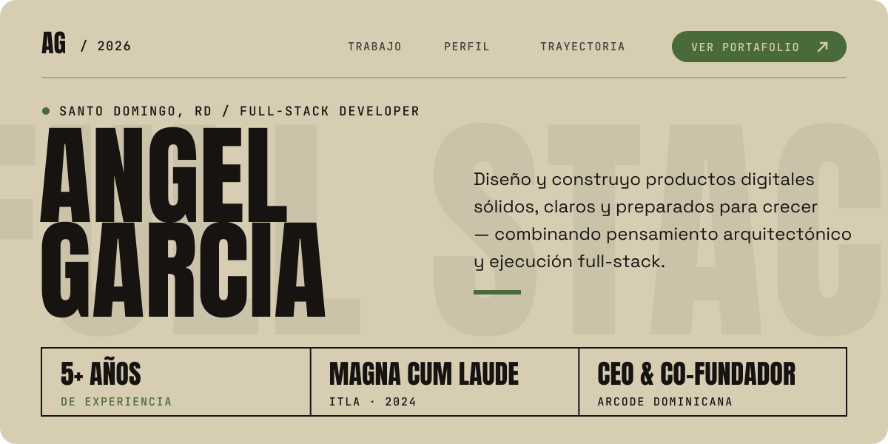
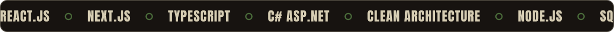
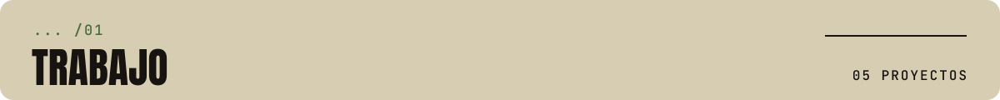
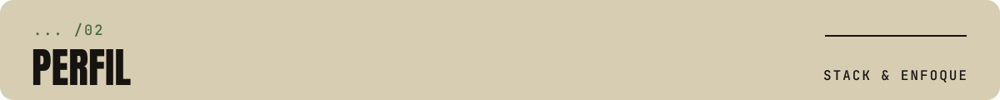
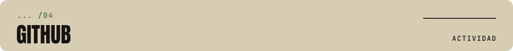
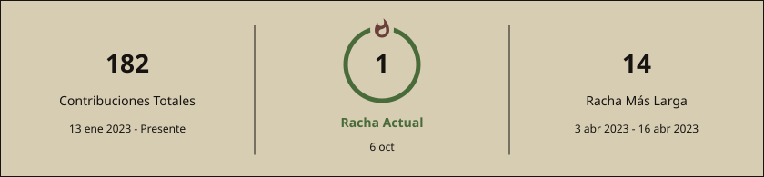
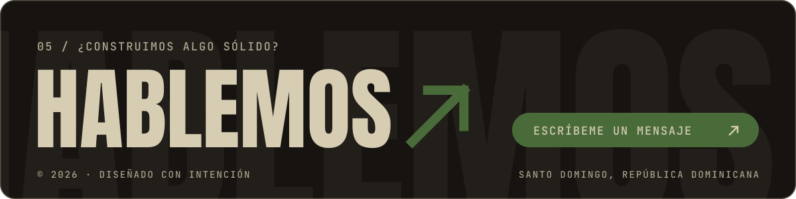

  
  
  

 

<table>
  <tr>
    <td width="72" align="center"><h3>01</h3></td>
    <td>
      <strong>ARCODE DOMINICANA</strong> &nbsp;·&nbsp; <code>EMPRESA PROPIA</code> <code>CONCLUIDO</code> 
      Casa de software que fundé y dirijo: sitios, aplicaciones web, tiendas en línea y sistemas a medida para empresas dominicanas. Lideré producto, identidad y desarrollo del sitio, incluyendo un cotizador automático que estima el costo de un proyecto en minutos. 
      <code>REACT.JS</code> <code>PRODUCTO</code> <code>UI/UX</code>
    </td>
  </tr>
  <tr>
    <td align="center"><h3>02</h3></td>
    <td>
      <strong>MOVIA — MOVIES &amp; SERIES</strong> &nbsp;·&nbsp; <code>CONCLUIDO</code> 
      Plataforma social de streaming: películas y series en español e inglés con subtítulos, watch parties con amigos, «ver más tarde» e historial, y grupos de contenido públicos o privados con permisos por miembro. 
      <code>REACT.JS</code> <code>EXPRESS.JS</code> <code>MYSQL</code> <code>WATCH PARTY</code>
    </td>
  </tr>
  <tr>
    <td align="center"><h3>03</h3></td>
    <td>
      <strong>SISTEMA DE GESTIÓN DE INCIDENCIAS</strong> &nbsp;·&nbsp; <code>CONCLUIDO</code> 
      Gestión de incidencias a nivel empresarial, con control de usuarios, reportes y notificaciones. Modo claro y oscuro. 
      <code>REACT.JS</code> <code>C# ASP.NET</code> <code>CLEAN ARCHITECTURE</code> <code>SQL SERVER</code>
    </td>
  </tr>
  <tr>
    <td align="center"><h3>04</h3></td>
    <td>
      <strong>«MUERTO DE HAMBRE» — GESTIÓN DE RESTAURANTE</strong> &nbsp;·&nbsp; <code>EN DESARROLLO</code> 
      Sistema completo de restaurante con gestión de menú, pedidos y usuarios. 
      <code>NODE.JS</code> <code>EXPRESS</code> <code>REACT.JS</code> <code>AXIOS</code> <code>REPOSITORY</code>
    </td>
  </tr>
  <tr>
    <td align="center"><h3>05</h3></td>
    <td>
      <strong>«BETSENSE» — PREDICCIÓN DEPORTIVA CON IA</strong> &nbsp;·&nbsp; <code>CONCLUIDO</code> 
      Predicción de resultados deportivos con IA, análisis de datos de distintas APIs y consultas en internet, con control de usuarios e historial de predicciones. 
      <code>REACT.JS</code> <code>C# ASP.NET</code> <code>CLEAN ARCHITECTURE</code> <code>SQL SERVER</code>
    </td>
  </tr>
</table>

<a href="https://portafolioag.arcodedominicana.com/#projects"><code>VER PROYECTOS ↘</code></a>

Desarrollador Full-Stack con más de 5 años creando soluciones para empresas y organizaciones del sector salud. CEO y co-fundador de **ARCODE Dominicana**, donde dirijo un equipo que construye software a medida. Graduado Magna Cum Laude del ITLA; combino pensamiento de producto, arquitectura limpia y ejecución técnica.

<table>
  <tr>
    <td width="50%" valign="top">
      <strong>FRONTEND</strong> &nbsp;<code>07</code>  
      
      
      
      
      
      
      
      
      
      
    </td>
    <td width="50%" valign="top">
      <strong>BACKEND</strong> &nbsp;<code>06</code>  
      
      
      
      
      
      
      
      
      
    </td>
  </tr>
  <tr>
    <td valign="top">
      <strong>DATOS &amp; CLOUD</strong> &nbsp;<code>07</code>  
      
      
      
      
      
      
      
    </td>
    <td valign="top">
      <strong>LIDERAZGO</strong> &nbsp;<code>06</code>  
      Liderazgo de equipos 
      Levantamiento de requerimientos 
      Metodologías ágiles 
      CEO de ARCODE Dominicana 
      Español nativo · Inglés avanzado
    </td>
  </tr>
</table>

| Período | Hito | Detalle |
| :-- | :-- | :-- |
| <code>DIC&nbsp;2024&nbsp;—&nbsp;HOY</code> | **ARCODE DOMINICANA** CEO & Co-Fundador · Desarrollador Full Stack | Dirijo la empresa y el desarrollo: React.js, C# ASP.NET con Clean Architecture, APIs REST y optimización en SQL Server. |
| <code>2021&nbsp;—&nbsp;2024</code> | **ITLA** Técnico Superior en Desarrollo de Software | Graduado **Magna Cum Laude** del Instituto Tecnológico de Las Américas. |

| # | Certificación | Emisor | Estado |
| :-- | :-- | :-- | :-- |
| `01` | **IT Essentials — Fundamentos del Computador** | Cisco Networking Academy @ ITLA | `MAY 2021` |
| `02` | **The Complete Full-Stack Web Dev Bootcamp** | Udemy · 61.5 h | `JUL 2025` |
| `03` | **Complete Web Design: Figma to Webflow** | Udemy · 21.5 h | `EN CURSO` |
| `04` | **Docker de Cero a Experto: Compose & Swarm** | Udemy · 22 h | `EN CURSO` |

  
  

  

> Fuera del código: dibujo, anime y videojuegos. Próxima meta: aprender japonés.

